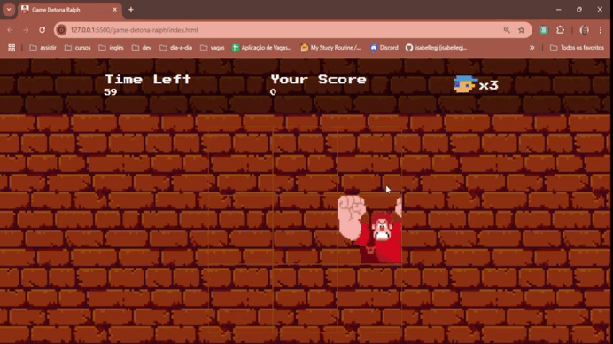

# Jogo Detona Ralph
O "Jogo Detona Ralph" é um jogo interativo onde os jogadores devem clicar em blocos para acumular pontos, enquanto um inimigo aparece aleatoriamente na tela. O objetivo é alcançar uma pontuação específica antes que o tempo acabe.

## 🎥 Demonstração


## 🛠 Tecnologias Utilizadas
- HTML5
- CSS3
- JavaScript

## 🎲 Como jogar
1. Clone o repositório:
```bash
git clone https://github.com/seu-usuario/game-detona-ralph.git

```
2. Acesse a pasta do projeto e abra o arquivo `index.html` no navegador de sua preferência.
3. Clique nos blocos que se tornam "inimigos" (representados pelo Ralph) antes que o tempo acabe. Cada acerto aumenta sua pontuação.
4. O jogo conta com um temporizador de 60 segundos. Ao zerar o cronômetro, o jogo termina.
5. O jogador precisa acumular 50 pontos para vencer.

## 📚 Aprendizados
Durante o desenvolvimento deste projeto, com o apoio e explicações do mentor, consegui aplicar na prática alguns conceitos fundamentais de JavaScript que guiarão meus estudos daqui para frente. A proposta do desafio foi divertida e permitiu experimentar como o JavaScript pode transformar uma página em algo interativo e funcional, proporcionando uma visão prática do código.

Ao longo do processo, aprendi a dividir o código em `funções` menores e específicas, o que facilitou a organização e a manutenção do projeto. A utilização do `addEventListener` foi essencial para criar uma interação dinâmica com o usuário, permitindo capturar e verificar se o jogador clicou no bloco correto. Além disso, usei `setInterval` para controlar o temporizador do jogo e `clearInterval` para encerrar o jogo assim que o tempo acabava, garantindo uma experiência de jogo precisa e envolvente.

## 🤝 Contribuição
Contribuições são bem-vindas! Se você deseja melhorar este jogo, adicionar novos recursos ou corrigir problemas, sinta-se à vontade para abrir um _pull request_.