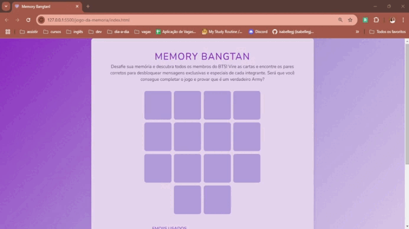

# Memory Bangtan
Memory Bangtan é um jogo de memória temático inspirado no grupo BTS, como o Army apaixonada não deixaria essa oportunidade passar. O objetivo é encontrar os pares de cartas com emojis representando cada membro do grupo. Ao completar o jogo, você desbloqueia uma mensagem especial que celebra sua vitória!

## 🎥 Demonstração

## 🛠 Tecnologias Utilizadas
- HTML5
- CSS3
- JavaScript

## 🎮 Como Jogar
1. Faça um clone deste repositório e abra o arquivo `index.html` em um navegador de sua escolha.
2. Clique em uma carta para revelá-la.
3. Tente encontrar a carta correspondente para formar um par.
4. Continue virando as cartas até encontrar todos os pares.

Se você conseguir completar o jogo, uma mensagem especial será exibida para celebrar sua conquista!

## 📚 Aprendizados
Sempre fico encantada com a didática do professor Felipe da DIO e com a maneira como ele nos envolve nos projetos, e neste não poderia ser diferente!

Neste projeto, pude explorar mais o JavaScript e perceber as possibilidades que ele oferece quando temos uma boa lógica e conhecimento da linguagem. Trabalhei com a manipulação do DOM para criar elementos dinâmicos, implementei a lógica para embaralhar as cartas e utilizei transições CSS para melhorar os efeitos visuais.

Notei também várias áreas novas que preciso estudar mais a fundo, tanto em CSS quanto em JavaScript. Alguns desses tópicos incluem `user-select`, `transform-style`, `perspective`, `after` e `backface-visibility` no CSS, e `appendChild()` no JavaScript. Fora isso, "nada de novo debaixo do sol", como diria o professor. Percebi que, embora conheça o conceito de muitos desses recursos, raramente os aplico. Então, vou fazer mais projetos para praticar e consolidar esse conhecimento!

## 🤝 Contribuição
Contribuições são bem-vindas! Se você deseja melhorar este jogo, adicionar novos recursos ou corrigir problemas, sinta-se à vontade para abrir um _pull request_.