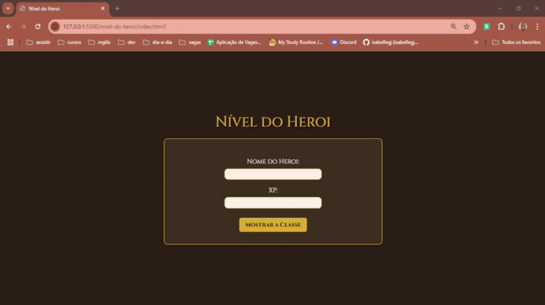

# Nível do Herói
O **Nível do Herói** é um classificador que define o nível do personagem com base em sua pontuação de XP. Este projeto foi desenvolvido como um desafio de código para testar conhecimentos em variáveis, operadores e estruturas de decisão.

## 🎥 Demonstração


## 🛠 Tecnologias Utilizadas
- HTML5
- CSS3
- JavaScript

## Como funciona
1. Clone o repositório:
```bash
git clone https://github.com/seu-usuario/nivel-do-heroi.git
```
2. Acesse a pasta do projeto e abra o arquivo `index.html` no navegador de sua preferência.
3. Preencha os campos com o nome do personagem e um valor de XP.
4. Clique no botão "Mostrar a Classe" e o nível correspondente ao XP será exibido.

## 📚 Aprendizados
Durante o desenvolvimento, percebi a importância de escolher a estrutura de decisão correta. Optei pelo `switch` para facilitar a leitura, pois usar `if-else` em vários casos poderia tornar o código extenso. Utilizei `getElementById` para acessar elementos de forma dinâmica e simplifiquei a exibição da mensagem com interpolação no alert.

## 🤝 Contribuição
Contribuições são bem-vindas! Se você deseja melhorar este jogo, adicionar novos recursos ou corrigir problemas, sinta-se à vontade para abrir um _pull request_.